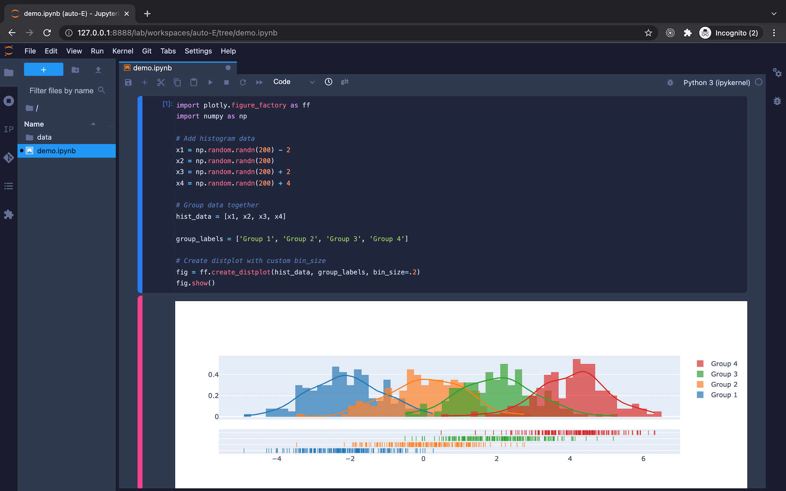

# docker-jupyter-spark

[](https://hub.docker.com/r/franzdiebold/jupyter-spark)
[](https://github.com/FranzDiebold/docker-jupyter-spark)
[](./LICENSE)

A customized [Jupyter](https://jupyter.org/) [Spark](https://spark.apache.org/docs/latest/api/python/) [Docker](https://www.docker.com/) image.



## What's in?

- Everything from [jupyter/all-spark-notebook](https://hub.docker.com/r/jupyter/all-spark-notebook)
  - [Python v3.9](https://www.python.org/)
  - [Scala v2.12](https://www.scala-lang.org/) (via `spylon-kernel`)
  - [R v4.1](https://www.r-project.org/)
  - [Spark v3.2](https://spark.apache.org/docs/latest/api/python/)
  - [JupyterLab v3.2](https://jupyter.org/)
- Theme: [Jupyterlab Darkside UI](https://github.com/dunovank/jupyterlab_darkside_ui)
- More packages:
  - [Plotly v5.5](https://plotly.com/python/)
  - [Git](https://git-scm.com/) support

## How to use?

```bash
docker run -p 8888:8888 -p 4040:4040 franzdiebold/jupyter-spark
```

The following web apps will be available:

- JupyterLab: [http://localhost:8888/lab/](http://localhost:8888/lab/)
- Spark Web UI: [http://localhost:4040/](http://localhost:4040/)

## Use it in your daily routine :rocket:

In your `.zshrc` / `.bashrc` file add:

```bashrc
alias jupyter='docker run --rm -p 8888:8888 -p 4040:4040 -v "${PWD}":/home/jovyan franzdiebold/jupyter-spark:latest'
```

## Build image locally

```bash
make build
```
