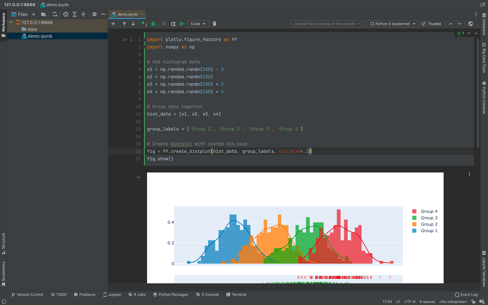
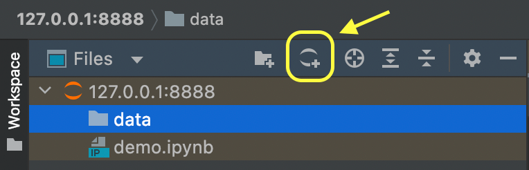
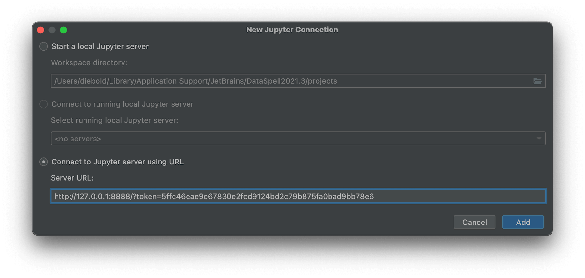

# Data Science Ultimate Server Docker image

[](https://hub.docker.com/r/franzdiebold/datascience-ultimate-server)
[](https://hub.docker.com/r/franzdiebold/datascience-ultimate-server)
[](https://github.com/FranzDiebold/docker-datascience-ultimate)
[](./LICENSE)

A customized [Jupyter Server](https://jupyter.org/) [Spark](https://spark.apache.org/docs/latest/api/python/) [Docker](https://www.docker.com/) image packed with everything you need.



## What's in?

- Everything from [jupyter/all-spark-notebook](https://hub.docker.com/r/jupyter/all-spark-notebook)
  - [Python v3.10](https://www.python.org/)
  - [Scala v2.12](https://www.scala-lang.org/) (via `spylon-kernel`)
  - [R v4.2](https://www.r-project.org/)
  - [Spark v3.3](https://spark.apache.org/docs/latest/api/python/)
  - [JupyterLab v3.5](https://jupyter.org/)
  - [Pandas v1.5](https://pandas.pydata.org/)
  - [Numpy v1.23](https://numpy.org/)
  - [scikit-learn v1.1](https://scikit-learn.org/)
  - [SciPy v1.9](https://scipy.org/)
  - [Seaborn v0.12](https://seaborn.pydata.org/)
- More packages:
  - [XGBoost v1.7](https://xgboost.ai/)
  - [Plotly v5.13](https://plotly.com/python/)
  - [Polars v0.16](https://www.pola.rs/)
  - [Graphviz v0.20](https://github.com/xflr6/graphviz)
  - [JAWSume v0.1](https://github.com/FranzDiebold/jawsume)

## How to use?

```bash
docker run -p 8888:8888 -p 4040:4040 franzdiebold/datascience-ultimate-server
```

The following endpoints / web apps will be available:

- Jupyter Server: [http://localhost:8888/](http://localhost:8888/)
- Spark Web UI: [http://localhost:4040/](http://localhost:4040/)

### Usage in [JetBrains DataSpell](https://www.jetbrains.com/dataspell/)

To [connect to a Jupyter server](https://www.jetbrains.com/help/dataspell/configuring-jupyter-notebook.html#remote) in JetBrains DataSpell:

1. Click the _"Add Jupyter Connection"_ icon on the toolbar of the Workspace tool window.
   
2. Select the connection type _"Connect to Jupyter server using URL"_, add the URL "http://127.0.0.1:8888/?token=<your-token>" to _"Server URL"_ and click _"Add"_.
   

## Use it in your daily routine :rocket:

In your `.zshrc` / `.bashrc` file add:

```bashrc
alias jupyter-server='docker run --rm -p 8888:8888 -p 4040:4040 -v "${PWD}":/home/jovyan franzdiebold/datascience-ultimate-server:latest'
```

> 💪 For an even better integration into your daily Data Science routine, check out the [dockerize-datascience](https://github.com/FranzDiebold/dockerize-datascience) repo.

## Build image locally

```bash
make build-server-arm  # linux/arm64 architecture
make build-server-amd  # linux/amd64 architecture
```
