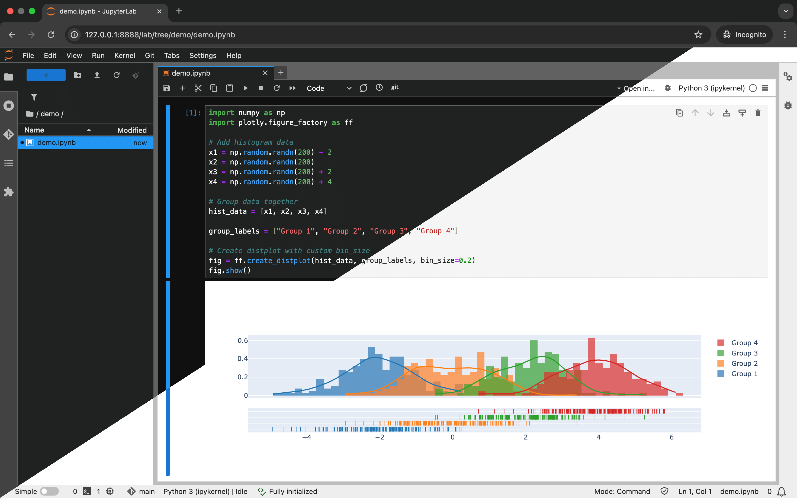

# Data Science Ultimate Docker image

[](https://hub.docker.com/r/franzdiebold/datascience-ultimate)
[](https://hub.docker.com/r/franzdiebold/datascience-ultimate)
[](https://github.com/FranzDiebold/docker-datascience-ultimate)
[](./LICENSE)

A customized [JupyterLab](https://jupyter.org/) [Spark](https://spark.apache.org/docs/latest/api/python/) [Docker](https://www.docker.com/) image packed with everything you need.



## What's in?

- Everything from [jupyter/all-spark-notebook](https://hub.docker.com/r/jupyter/all-spark-notebook)
  - [Python v3.10](https://www.python.org/)
  - [Scala v2.12](https://www.scala-lang.org/) (via `spylon-kernel`)
  - [R v4.2](https://www.r-project.org/)
  - [Spark v3.3](https://spark.apache.org/docs/latest/api/python/)
  - [JupyterLab v3.5](https://jupyter.org/)
  - [Pandas v1.4](https://pandas.pydata.org/)
  - [Numpy v1.22](https://numpy.org/)
  - [scikit-learn v1.0](https://scikit-learn.org/)
  - [SciPy v1.7](https://scipy.org/)
  - [Seaborn v0.11](https://seaborn.pydata.org/)
- More packages:
  - [XGBoost v1.7](https://xgboost.ai/)
  - [Plotly v5.11](https://plotly.com/python/)
  - [Polars v0.14](https://www.pola.rs/)
  - [Graphviz v0.20](https://github.com/xflr6/graphviz)
  - [JAWSume v0.1](https://github.com/FranzDiebold/jawsume)
  - [Git](https://git-scm.com/) support
- Theme: [JupyterLab Darkside UI](https://github.com/dunovank/jupyterlab_darkside_ui)
- Code formatting: [Jupyterlab Code Formatter](https://jupyterlab-code-formatter.readthedocs.io/) using [Black code formatter](https://black.readthedocs.io/en/stable/)

## How to use?

```bash
docker run -p 8888:8888 -p 4040:4040 franzdiebold/datascience-ultimate
```

The following web apps will be available:

- JupyterLab: [http://localhost:8888/lab/](http://localhost:8888/lab/)
- Spark Web UI: [http://localhost:4040/](http://localhost:4040/)

## Use it in your daily routine :rocket:

In your `.zshrc` / `.bashrc` file add:

```bashrc
alias jupyter='docker run --rm -p 8888:8888 -p 4040:4040 -v "${PWD}":/home/jovyan franzdiebold/datascience-ultimate:latest'
```

> 💪 For an even better integration into your daily Data Science routine, check out the [dockerize-datascience](https://github.com/FranzDiebold/dockerize-datascience) repo.

## Build image locally

```bash
make build-lab-arm  # linux/arm64 architecture
make build-lab-amd  # linux/amd64 architecture
```
